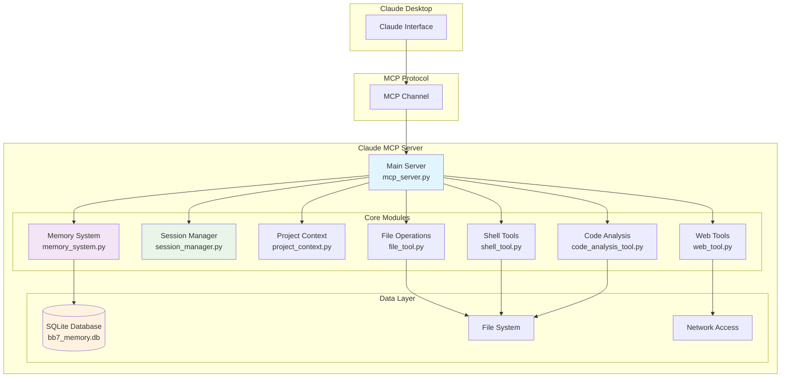

# Claude MCP Server 🤖⚡

> **A comprehensive Model Context Protocol (MCP) server designed for collaborative intelligence with Claude, featuring advanced memory systems, session management, project analysis, and development tools.**

[](https://www.python.org/downloads/)
[](https://modelcontextprotocol.io/)
[](https://github.com/jlowin/fastmcp)

## 🌟 Overview

This Claude MCP Server transforms Claude from a conversational AI into a powerful **collaborative intelligence system** capable of:

- 🧠 **Persistent Memory**: Store and recall insights, decisions, and context across sessions
- 📊 **Session Management**: Organize work sessions with intelligent tracking and summarization
- 🔍 **Project Analysis**: Deep code analysis, dependency auditing, and health assessment
- 🛠️ **Development Tools**: File operations, shell execution, and code analysis
- 🌐 **Web Integration**: Content fetching, search capabilities, and webpage analysis
- 🔒 **Security Auditing**: Code security scanning and vulnerability detection

## 🚀 Quick Start

### Prerequisites

- **Python 3.11+**
- **Claude Desktop** or **Claude Code** (with MCP support)
- **Windows 11** (primary target, adaptable to other platforms)

### Installation

1. **Clone the repository:**

   ```bash
   git clone <repository-url>
   cd claude_mcp
   ```

2. **Create virtual environment:**

   ```bash
   python -m venv .venv
   .venv\Scripts\activate  # Windows
   # source .venv/bin/activate  # Linux/Mac
   ```

3. **Install dependencies:**

   ```bash
   pip install -r requirements.txt
   ```

4. **Configure Claude Desktop:**

   See the comprehensive [**Claude MCP Server Deep Dive How to Manual**](documentation/Claude%20MCP%20Server%20Deep%20Dive%20How%20to%20Manual.md) for detailed setup instructions.

### Quick Verification

Once configured, test the server with this sequence:

```
1. bb7_welcome                     # Introduction and overview
2. bb7_server_info                 # See all available tools
3. bb7_health_check               # Verify system status
4. bb7_start_session              # Begin collaborative session
5. bb7_memory_store               # Test persistent memory
6. bb7_analyze_project_structure  # Test project analysis
```

## 🛠️ Tool Modules & Capabilities

The server provides **39+ bb7_ tools** organized across **7 specialized modules**:

### 🎯 Core Server Tools (3 tools)

Located in: `mcp_server.py`

- **bb7_welcome** - Introduction and system overview
- **bb7_server_info** - Comprehensive server information and capabilities
- **bb7_health_check** - System diagnostics and health verification

### 🧠 Memory System (6 tools)

Located in: `memory_system.py`

- **bb7_memory_store** - Save insights, decisions, and context permanently
- **bb7_memory_search** - Find relevant past insights with advanced search
- **bb7_memory_recall** - Retrieve specific memories by ID or context
- **bb7_memory_synthesize** - Generate insights from stored memories
- **bb7_memory_list_categories** - Browse memory categories and organization
- **bb7_memory_insights** - Get intelligent analysis of memory patterns

### 📊 Session Management (5 tools)

Located in: `session_manager.py`

- **bb7_start_session** - Begin development sessions with goal tracking
- **bb7_record_insight** - Capture important discoveries and learnings
- **bb7_record_decision** - Document decisions with reasoning and alternatives
- **bb7_session_summary** - Generate comprehensive session summaries
- **bb7_list_sessions** - Browse and filter past sessions
- **bb7_end_session** - Complete sessions with final insights

### 🔍 Project Analysis (3 tools)

Located in: `project_context.py`

- **bb7_analyze_project_structure** - Deep codebase analysis with technology detection
- **bb7_get_project_dependencies** - Dependency analysis with security assessment
- **bb7_project_health_check** - Comprehensive project health and quality metrics

### 💻 Shell Operations (7 tools)

Located in: `shell_tool.py`

- **bb7_execute_command** - Execute shell commands across multiple environments
- **bb7_list_shells** - Discover available shell environments
- **bb7_set_default_shell** - Configure preferred shell environment
- **bb7_command_history** - View command execution history and patterns
- **bb7_get_system_info** - Comprehensive system information and diagnostics
- **bb7_manage_environment** - Environment variable management
- **bb7_shell_scripting** - Execute multi-line scripts safely

### 📁 File Operations (7 tools)

Located in: `file_tool.py`

- **bb7_read_file** - Read files with intelligent content analysis
- **bb7_write_file** - Write files with backup and safety features
- **bb7_copy_file** - Copy files with conflict resolution
- **bb7_move_file** - Move/rename files safely
- **bb7_delete_file** - Delete files with confirmation and backup
- **bb7_list_directory** - Browse directories with filtering and analysis
- **bb7_search_files** - Advanced file search with content analysis
- **bb7_file_info** - Detailed file metadata and analysis
- **bb7_operation_history** - Track file operation history

### 🌐 Web Tools (4 tools)

Located in: `web_tool.py`

- **bb7_fetch_url** - Fetch and analyze web content with intelligent processing
- **bb7_search_web** - Web search with relevance scoring and insights
- **bb7_analyze_webpage** - Deep webpage analysis and content extraction
- **bb7_download_file** - Download files with integrity verification

### 🔒 Code Analysis (4 tools)

Located in: `code_analysis_tool.py`

- **bb7_analyze_code** - Comprehensive code analysis with quality metrics
- **bb7_code_suggestions** - AI-powered code improvement suggestions
- **bb7_security_audit** - Security vulnerability scanning and recommendations
- **bb7_execute_code_safely** - Execute code in isolated environments

## 🔗 Claude Desktop Integration

The Claude MCP Server supports **two integration methods** with Claude Desktop:

### 🌐 Method 1: Remote Integration URL (Recommended - 2025)

**For Claude Desktop's new integration system** that requires URLs instead of direct connections:

#### Quick Start - HTTP Server

1. **Install dependencies:**

   ```bash
   pip install fastapi uvicorn
   ```

2. **Start HTTP server:**

   ```bash
   # Option A: Python launcher
   python start_http_server.py

   # Option B: PowerShell (Windows)
   .\start_http_server.ps1

   # Option C: Direct command
   python mcp_server.py --http --host 0.0.0.0 --port 8000
   ```

3. **Configure Claude Desktop:**
   - Open Claude Desktop
   - Go to **Settings > Integrations**
   - Click **"Add more"** or **"Custom Integration"**
   - Enter URL: `http://localhost:8000/mcp/sse`
   - Save and restart Claude Desktop

4. **Verify connection:**
   - Look for the tools icon in Claude Desktop chat
   - Test with: "Use bb7_welcome to introduce yourself"

#### Available Endpoints

Once running, your server provides:

- **Server info:** `http://localhost:8000/`
- **Health check:** `http://localhost:8000/health`
- **Tools list:** `http://localhost:8000/mcp/tools`
- **SSE endpoint:** `http://localhost:8000/mcp/sse` ← Use this in Claude Desktop

### 📋 Method 2: Local MCP Server (Legacy)

For older Claude Desktop versions that support local configuration:

**Windows Location:** `C:\Users\{username}\AppData\Roaming\Claude\claude_desktop_config.json`

```json
{
  "mcpServers": {
    "claude-mcp-server": {
      "command": "python",
      "args": [
        "C:/Users/{username}/claude_mcp/mcp_server.py"
      ],
      "env": {
        "PYTHONPATH": "C:/Users/{username}/claude_mcp"
      }
    }
  }
}
```

**Note:** This method may not work with newer Claude Desktop versions that require integration URLs.

## 🚀 Usage Examples

### Basic Workflow

```python
# 1. Start collaborative session
bb7_start_session(goal="Analyze project architecture")

# 2. Analyze current project
bb7_analyze_project_structure(path="/path/to/project")

# 3. Store insights
bb7_memory_store(
    content="Key architectural patterns identified", 
    category="analysis"
)

# 4. Get recommendations
bb7_code_suggestions(file_path="src/main.py")
```

### Advanced Memory System

```python
# Store complex decisions
bb7_record_decision(
    decision="Migration to FastAPI", 
    reasoning="Better async support",
    alternatives=["Flask", "Django"]
)

# Smart memory search
bb7_memory_search(query="API performance optimizations")

# Memory synthesis
bb7_memory_synthesize(topic="project architecture patterns")
```

### Project Health Assessment

```python
# Comprehensive health check
bb7_project_health_check(path="/project/root")

# Security audit
bb7_security_audit(target="/src/")

# Dependency analysis
bb7_get_project_dependencies(path="/project")
```

## 🏗️ Architecture



## 📊 Features Deep Dive

### Persistent Memory System

- **SQLite-based** persistent storage across sessions
- **Smart categorization** with automatic tagging
- **Advanced search** with relevance scoring
- **Memory synthesis** for pattern recognition
- **Insight generation** from stored knowledge

### Session Management

- **Goal-oriented** session tracking
- **Decision documentation** with reasoning capture
- **Insight recording** for knowledge building
- **Session summaries** with key outcomes
- **Historical analysis** of development patterns

### Project Intelligence

- **Technology detection** and stack analysis
- **Dependency mapping** with security assessment
- **Code quality metrics** and health scoring
- **Architecture pattern recognition**
- **Performance bottleneck identification**

### Security & Safety

- **Code execution sandboxing**
- **Security vulnerability scanning**
- **Safe file operations** with backup systems
- **Command validation** and sanitization
- **Environment isolation**

## 🔧 Configuration

### Environment Variables

```bash
# Optional: Custom database location
export BB7_DB_PATH="/custom/path/bb7_memory.db"

# Optional: Logging level
export BB7_LOG_LEVEL="INFO"

# Optional: Session timeout (seconds)
export BB7_SESSION_TIMEOUT="3600"
```

### Advanced Configuration

Create `config.json` in project root:

```json
{
  "database": {
    "path": "data/bb7_memory.db",
    "backup_enabled": true,
    "backup_interval": 3600
  },
  "memory": {
    "max_entries": 10000,
    "auto_categorize": true,
    "similarity_threshold": 0.7
  },
  "security": {
    "safe_mode": true,
    "allowed_commands": ["git", "npm", "pip"],
    "restricted_paths": ["/etc", "/sys"]
  }
}
```

## 🌐 Remote Deployment

For remote MCP server deployment (Claude Max/Team/Enterprise):

### Option 1: FastAPI HTTP Server

```python
# Add to mcp_server.py
from fastapi import FastAPI
from fastapi.responses import StreamingResponse
import uvicorn

app = FastAPI()

@app.post("/mcp")
async def mcp_endpoint(request: dict):
    # Handle MCP protocol over HTTP
    pass

@app.get("/mcp/sse")
async def mcp_sse():
    # Server-Sent Events endpoint
    pass

if __name__ == "__main__":
    uvicorn.run(app, host="0.0.0.0", port=8000)
```

### Option 2: Cloud Deployment

Deploy to major cloud platforms:

- **Heroku**: `git push heroku main`
- **AWS Lambda**: Use `serverless` framework
- **Google Cloud Run**: Deploy containerized version
- **Railway**: Connect GitHub repo for auto-deployment

## 🧪 Testing

### Unit Tests

```bash
python -m pytest tests/ -v
```

### Integration Tests

```bash
python test_script.py
```

### Manual Testing

```bash
# Start server
python mcp_server.py

# Test in separate terminal
echo '{"jsonrpc": "2.0", "method": "tools/list", "id": 1}' | python mcp_server.py
```

## 📝 Development Guide

### Adding New Tools

1. **Create tool function** in appropriate module:

```python
@mcp.tool()
def bb7_your_tool(param: str) -> str:
    """Your tool description."""
    # Implementation
    return result
```

2. **Register in main server**:

```python
# Add to mcp_server.py imports
from your_module import bb7_your_tool
```

### Contributing

1. Fork the repository
2. Create feature branch: `git checkout -b feature/new-tool`
3. Add comprehensive tests
4. Update documentation
5. Submit pull request

## 🔍 Troubleshooting

### Common Issues

**Server won't start:**

```bash
# Check Python path
python --version  # Should be 3.11+

# Verify dependencies
pip install -r requirements.txt

# Check logs
tail -f mcp_server.log
```

**Tools not registering:**

```bash
# Enable debug logging
export BB7_LOG_LEVEL="DEBUG"
python mcp_server.py
```

**Memory system errors:**

```bash
# Reset database
rm data/bb7_memory.db
python mcp_server.py  # Will recreate
```

**Claude Desktop connection:**

```bash
# Verify config file
cat ~/.config/Claude/claude_desktop_config.json  # Linux/Mac
type %APPDATA%\Claude\claude_desktop_config.json  # Windows

# Restart Claude Desktop after config changes
```

### Performance Optimization

- **Memory usage**: Set `BB7_SESSION_TIMEOUT` for automatic cleanup
- **Database size**: Use `bb7_memory_insights` to identify cleanup opportunities
- **Response time**: Enable query caching in SQLite configuration

## 📄 License

This project is licensed under the MIT License - see the [LICENSE](LICENSE) file for details.

## 🤝 Contributing

We welcome contributions! Please see our [Contributing Guidelines](CONTRIBUTING.md) for details.

## 📚 Documentation

- **[Deep Dive Manual](documentation/Claude%20MCP%20Server%20Deep%20Dive%20How%20to%20Manual.md)** - Complete setup and usage guide
- **[Architecture Diagram](mcp.mmd)** - Mermaid diagram of system architecture
- **[API Reference](docs/api.md)** - Complete tool documentation
- **[Examples](examples/)** - Usage examples and tutorials

## 🔗 Related Projects

- **[Model Context Protocol](https://modelcontextprotocol.io/)** - Official MCP specification
- **[FastMCP](https://github.com/jlowin/fastmcp)** - FastMCP framework
- **[Claude Desktop](https://claude.ai/download)** - Claude Desktop application

## 💬 Support

- **Issues**: [GitHub Issues](https://github.com/yourusername/claude-mcp-server/issues)
- **Discussions**: [GitHub Discussions](https://github.com/yourusername/claude-mcp-server/discussions)
- **Documentation**: [Wiki](https://github.com/yourusername/claude-mcp-server/wiki)

---

**Built with ❤️ for the Claude MCP ecosystem**

*Transform Claude into your ultimate collaborative intelligence partner*

- **bb7_execute_code_safely** - Safe code execution with analysis and insights

## 🏗️ Architecture

```
Claude MCP Server
├── 🎯 Core Server (mcp_server.py)
│   ├── FastMCP Framework Integration
│   ├── Tool Module Loading
│   └── Health & Info Systems
├── 🧠 Memory System (memory_system.py)
│   ├── Persistent JSON Storage
│   ├── Intelligent Search & Recall
│   └── Insight Synthesis
├── 📊 Session Management (session_manager.py)
│   ├── Goal-Oriented Sessions
│   ├── Decision Tracking
│   └── Progress Summarization
├── 🔍 Project Analysis (project_context.py)
│   ├── Multi-Language Support
│   ├── Framework Detection
│   └── Quality Assessment
├── 💻 Shell Operations (shell_tool.py)
│   ├── Cross-Platform Support
│   ├── Environment Management
│   └── Command History
├── 📁 File Operations (file_tool.py)
│   ├── Safe File Handling
│   ├── Backup Systems
│   └── Content Analysis
├── 🌐 Web Tools (web_tool.py)
│   ├── Content Fetching
│   ├── Search Integration
│   └── Analysis Engine
└── 🔒 Code Analysis (code_analysis_tool.py)
    ├── Security Scanning
    ├── Quality Metrics
    └── Safe Execution
```

## 📖 Documentation

- **[Claude MCP Server Deep Dive How to Manual](documentation/Claude%20MCP%20Server%20Deep%20Dive%20How%20to%20Manual.md)** - Comprehensive setup and usage guide
- **[Setup Guide](documentation/SetupGuide.md)** - Quick setup instructions
- **[Architecture Diagram](mcp.mmd)** - System architecture visualization

## 🔧 Configuration

The server automatically creates necessary data directories:

```
claude_mcp/
├── data/
│   ├── memory/          # Persistent memory storage
│   ├── sessions/        # Session data and summaries
│   └── logs/           # Operation logs
├── documentation/       # Comprehensive guides
└── requirements.txt    # Python dependencies
```

## 🎛️ Environment Variables

Optional environment variables for enhanced functionality:

```bash
# Claude optimization flags
CLAUDE_MODE=true                 # Enable Claude-specific optimizations
ENHANCED_REASONING=true          # Enable enhanced reasoning features
LONG_CONTEXT_MODE=true          # Enable long context processing

# Logging and debugging
LOG_LEVEL=INFO                  # Logging level (DEBUG, INFO, WARNING, ERROR)
DEBUG_MODE=false               # Enable debug mode
```

## 🔒 Security Features

- **Safe Code Execution**: Sandboxed execution with analysis
- **File Operation Safety**: Backup systems and validation
- **Security Auditing**: Vulnerability scanning for multiple languages
- **Input Validation**: Comprehensive input sanitization
- **Permission Management**: Controlled access to system resources

## 🤝 Contributing

We welcome contributions! Areas for enhancement:

- **Additional Language Support** in project analysis
- **Enhanced Security Patterns** for vulnerability detection  
- **Integration Modules** for popular development tools
- **Performance Optimizations** for large codebases
- **Cloud Storage Integration** for memory and sessions

## 📝 License

This project is licensed under the MIT License - see the [LICENSE](LICENSE) file for details.

## 🚀 Advanced Usage

### Collaborative Development Workflow

1. **Start a session** with `bb7_start_session` defining your goals
2. **Analyze your project** with `bb7_analyze_project_structure`
3. **Store insights** as you work with `bb7_memory_store`
4. **Track decisions** with `bb7_record_decision`
5. **Execute commands** safely with `bb7_execute_command`
6. **Analyze code** with `bb7_analyze_code` and `bb7_security_audit`
7. **End session** with `bb7_end_session` for summary and insights

### Memory-Driven Intelligence

The memory system enables Claude to:

- Remember project-specific insights across sessions
- Build knowledge about your codebase and preferences
- Provide contextual recommendations based on past work
- Synthesize patterns from multiple sessions

### Project Health Monitoring

Regular use of `bb7_project_health_check` provides:

- Code quality trends over time
- Dependency security monitoring
- Test coverage analysis
- Technical debt identification

---

**Built with ❤️ for collaborative intelligence between humans and Claude**

*For detailed setup instructions and advanced configuration, see the [Claude MCP Server Deep Dive How to Manual](documentation/Claude%20MCP%20Server%20Deep%20Dive%20How%20to%20Manual.md).*
